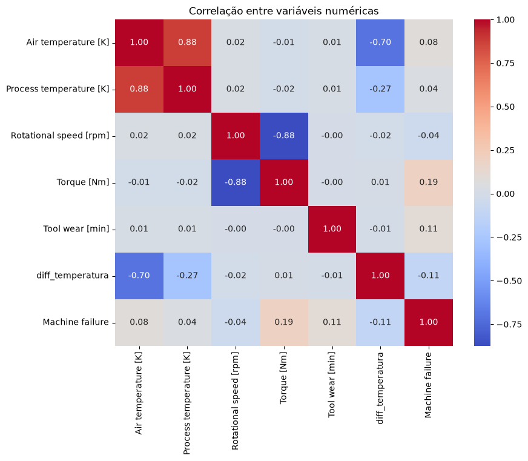
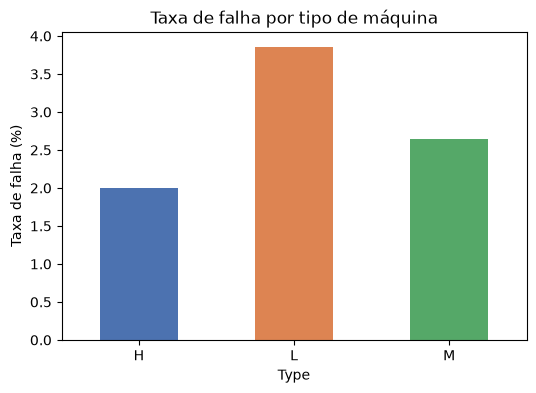
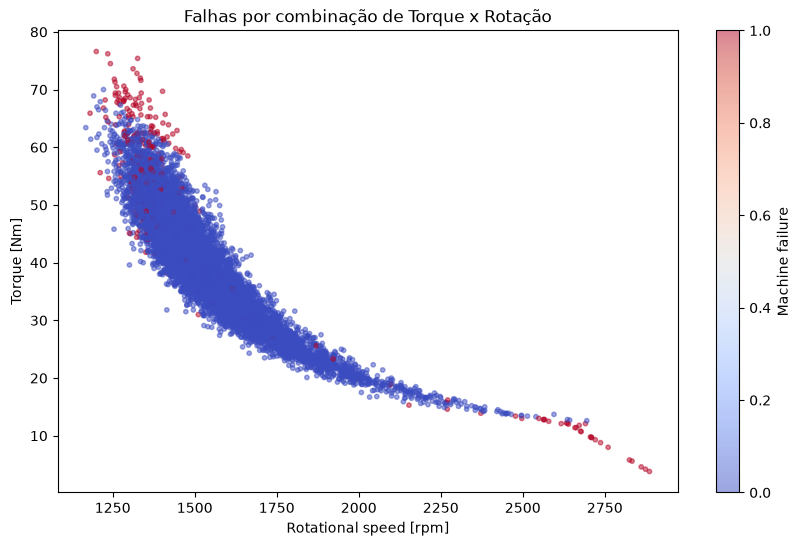
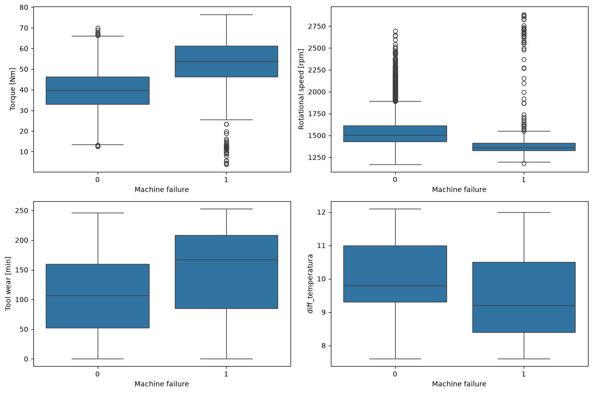
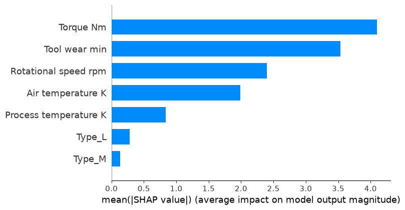
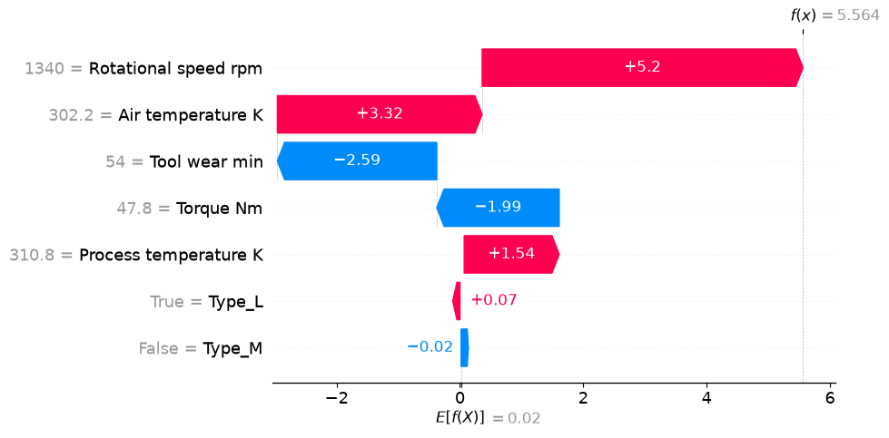
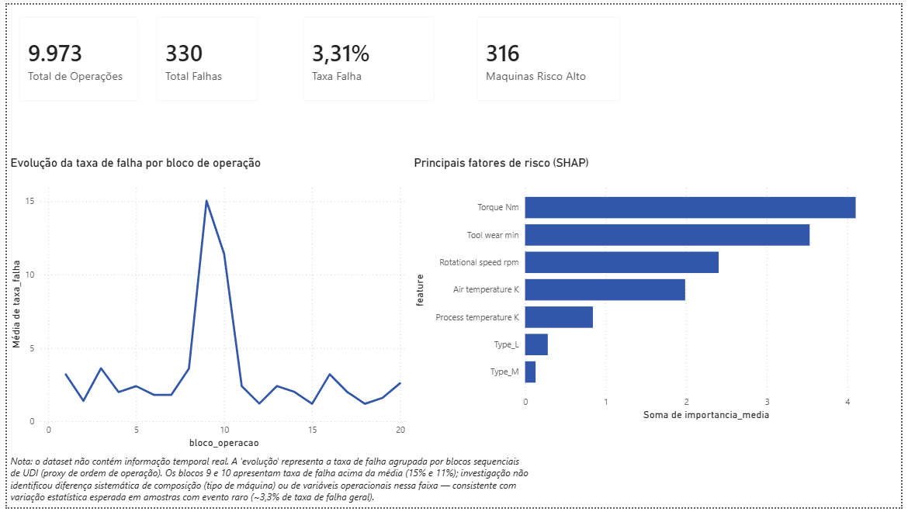
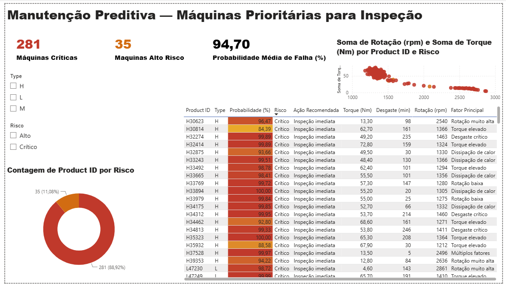

# Predictive Maintenance Intelligence

Análise de dados e machine learning aplicados à manutenção preditiva industrial, com o objetivo de identificar antecipadamente máquinas com maior risco de falha e converter essa previsão em recomendação de ação.

**Stack:** Python · Pandas · PostgreSQL · Scikit-learn · XGBoost · SHAP · Power BI

---

## Sobre o projeto

Este é um case de portfólio construído a partir de uma demanda simulada de uma indústria fictícia (NovaTech), que enfrentava aumento de paradas não planejadas e dificuldade para identificar equipamentos em risco.

**Pergunta central:** é possível usar dados operacionais das máquinas para identificar antecipadamente quais equipamentos apresentam maior risco de falha?

O projeto percorre o fluxo completo de análise: entendimento do problema → limpeza e auditoria dos dados → análise exploratória → consultas analíticas em SQL → modelagem preditiva → explicabilidade do modelo → dashboard executivo → recomendação de ação.

### Sobre os dados

Utiliza o **AI4I 2020 Predictive Maintenance Dataset** (UCI Machine Learning Repository), com 10.000 observações de máquinas de fresagem industrial.

> **Nota importante:** o AI4I é um dataset **sintético**, criado para fins de pesquisa. Não são dados confidenciais nem operações reais de uma empresa. Todas as conclusões deste projeto são válidas dentro desse contexto.

---

## Estrutura do repositório

```
predictive-maintenance/
├── data/
│   ├── raw/                       # dataset original (AI4I 2020)
│   └── processed/                 # dados limpos e enriquecidos
├── notebooks/
│   ├── 01_data_exploration.ipynb
│   ├── 02_data_cleaning.ipynb
│   ├── 03_eda.ipynb
│   ├── 05_model_training.ipynb
│   └── 06_model_explainability.ipynb
├── sql/
│   ├── 01_database.sql            # criação da tabela
│   ├── 02_kpis.sql                # KPIs gerais
│   └── 03_failure_analysis.sql    # análise por faixas operacionais
├── dashboard/
│   └── predictive_maintenance.pbix
├── models/
│   └── model.pkl
├── images/                        # gráficos e screenshots
├── requirements.txt
└── README.md
```

---

## Etapa 1 — Limpeza e auditoria dos dados

Antes de qualquer análise, os dados foram auditados quanto a integridade e consistência.

| Verificação | Resultado |
|---|---|
| Valores ausentes | Nenhum |
| Duplicatas | Nenhuma |
| Identificadores únicos (`UDI`, `Product ID`) | Confirmados |
| Consistência do rótulo | **27 inconsistências encontradas** |

### Data leakage identificado

O dataset contém cinco colunas indicando o **tipo** de falha ocorrida (`TWF`, `HDF`, `PWF`, `OSF`, `RNF`). Essas variáveis só ficam disponíveis **depois** que a falha acontece — usá-las como features para prever `Machine failure` produziria um modelo trivialmente correto e inútil na prática.

Essas colunas foram usadas **apenas para auditoria do rótulo**, nunca como entrada do modelo.

### Inconsistências de rótulo

Cruzando `Machine failure` com a soma dos subtipos, foram encontrados:

- 9 registros com falha marcada, mas nenhum subtipo registrado
- 18 registros com subtipo registrado, mas falha não marcada

**Decisão:** os 27 registros (0,27% do total) foram removidos por representarem ruído de rótulo. Base final: **9.973 registros**.

---

## Etapa 2 — Análise exploratória (EDA)

Taxa geral de falha: **3,31%** — dataset severamente desbalanceado, o que orientou toda a estratégia de modelagem e avaliação.

### Visão geral das correlações



A matriz revela dois pontos importantes:

**Nenhuma variável tem correlação linear forte com a falha.** A maior é o torque, com apenas **0,19**. Isso poderia sugerir que os dados têm pouco poder preditivo — mas a análise por faixas (abaixo) mostra o contrário: as relações existem e são fortes, só que **não são lineares**. A correlação de Pearson não captura padrões em "U" nem efeitos de limiar.

Esse foi um dos indícios mais claros de que modelos lineares seriam insuficientes, e antecipou a escolha de modelos baseados em árvore.

**Torque e rotação são fortemente inversos (−0,88)**, confirmando a relação física de potência aproximadamente constante. Air e Process temperature também andam juntas (0,88), o que motivou a criação da variável derivada `diff_temperatura`.

### Achado 1 — Qualidade do produto influencia o risco

| Tipo | Máquinas | Falhas | Taxa de falha |
|---|---|---|---|
| L (baixa qualidade) | 5.984 | 231 | **3,86%** |
| M (média qualidade) | 2.991 | 79 | 2,64% |
| H (alta qualidade) | 998 | 20 | 2,00% |



Máquinas de baixa qualidade falham proporcionalmente quase o dobro das de alta qualidade. A leitura correta aqui é a **taxa relativa**, não a contagem absoluta — o tipo L tem mais falhas em número bruto simplesmente porque representa 60% da frota.

### Achado 2 — Desgaste da ferramenta tem efeito de limiar

| Faixa de desgaste (min) | Taxa de falha |
|---|---|
| 0–50 | 2,09% |
| 51–100 | 2,29% |
| 101–150 | 2,05% |
| 151–200 | 2,82% |
| **201–253** | **15,39%** |

O risco permanece estável até ~200 minutos e então **salta 6x**. Não é um aumento gradual — é um limiar. Isso é diretamente acionável: sugere um ponto de corte operacional para troca ou inspeção da ferramenta.

### Achado 3 — Torque e rotação: risco em zonas, não em valores isolados

**Torque** apresenta padrão em "U", com escalada exponencial:

| Faixa (Nm) | Taxa de falha |
|---|---|
| 0–30 | 2,50% |
| **31–45** | **0,59%** (zona segura) |
| 46–55 | 4,47% |
| 56–65 | 17,41% |
| 66–76,6 | **83,08%** |

**Rotação** apresenta padrão inverso — risco alto em rotações baixas:

| Faixa (rpm) | Taxa de falha |
|---|---|
| 1101–1300 | **22,69%** |
| 1301–1500 | 4,75% |
| **1501–1600** | **0,51%** (zona segura) |
| 1601–2886 | 1,70% |



A análise bivariada (torque × rotação) revelou algo que nenhuma das duas variáveis mostrava isoladamente: as falhas se concentram em **duas zonas operacionais distintas** — rotação baixa com torque alto (sobrecarga mecânica) e rotação muito alta com torque baixo.

Esse achado antecipou uma decisão de modelagem: modelos lineares capturam mal interações desse tipo, o que justificou a comparação com modelos baseados em árvore.

### Distribuição das variáveis por ocorrência de falha



Os boxplots confirmam visualmente os achados anteriores: máquinas que falharam concentram torque mais alto, rotação mais baixa, desgaste maior e gradiente térmico menor.

### Achado 4 — Dissipação de calor

Criando a variável derivada `diff_temperatura` (temperatura do processo − temperatura do ar):

| Diferença (K) | Taxa de falha |
|---|---|
| **7,6–9** | **8,52%** |
| 9–9,5 | 2,23% |
| 9,5–10 | 1,97% |
| 10–10,5 | 2,72% |
| 10,5–11 | 2,26% |
| 11–12,1 | 2,06% |

Quando o gradiente térmico cai abaixo de ~9K, a taxa de falha **quadruplica**. Consistente com falhas por dissipação de calor: sem gradiente suficiente, a máquina não consegue dissipar calor de forma eficiente.

Vale notar que essa variável derivada se mostrou **mais informativa** que qualquer uma das temperaturas isoladamente — um dos três casos neste projeto em que engenharia de features baseada em entendimento de domínio revelou sinal mais forte que as colunas brutas.

---

## Etapa 3 — SQL / PostgreSQL

As mesmas perguntas de negócio foram respondidas em SQL puro, sobre uma base PostgreSQL, demonstrando a análise em duas ferramentas distintas.

Todos os resultados foram **validados cruzadamente** contra o Python (taxa de falha, contagens por tipo e por faixa bateram integralmente), o que também serviu como verificação de integridade da carga de dados.

```sql
-- Taxa geral de falha
SELECT
    COUNT(*) AS total_operacoes,
    SUM(machine_failure) AS total_falhas,
    ROUND(100.0 * SUM(machine_failure) / COUNT(*), 2) AS taxa_falha
FROM machine_data;
```

Os arquivos em `sql/` cobrem: criação da estrutura, KPIs gerais, e análise de falha por faixas de desgaste, torque, rotação e diferença de temperatura.

---

## Etapa 4 — Modelagem preditiva

**Objetivo:** prever `Machine failure` usando apenas parâmetros disponíveis *antes* da falha.

**Features:** Air temperature, Process temperature, Rotational speed, Torque, Tool wear, Type (one-hot encoded).

**Divisão:** 80% treino / 20% teste, com `stratify` para preservar a proporção de falhas (3,31%) em ambos os conjuntos — essencial num dataset tão desbalanceado.

### Comparação de modelos

| Modelo | Precision | Recall | F1-score | ROC-AUC |
|---|---|---|---|---|
| Logistic Regression | 0,76 | 0,20 | 0,31 | 0,9292 |
| Logistic Regression (balanceada) | 0,14 | 0,88 | 0,24 | 0,9292 |
| Random Forest (balanceado) | 0,73 | 0,74 | 0,74 | 0,9766 |
| **XGBoost (balanceado)** | **0,77** | **0,89** | **0,83** | **0,9774** |

*Métricas referentes à classe positiva (falha), no conjunto de teste.*

### Por que accuracy não foi usada como critério

O baseline sem balanceamento atingiu **97% de accuracy** — e ainda assim deixou passar **80% das falhas reais**. Como falhas representam apenas 3,31% dos casos, um modelo que simplesmente previsse "nunca falha" acertaria 96,7% das vezes sendo completamente inútil.

Em manutenção preditiva, o **falso negativo** (falha não detectada) é o erro mais caro: significa parada não planejada. Por isso a avaliação priorizou **recall**, equilibrado por precision via F1-score.

### Trade-off precision × recall

Balancear as classes na regressão logística elevou o recall de 0,20 para 0,88 — mas derrubou a precision para 0,14, gerando falsos alarmes demais para ser operacional.

O XGBoost resolveu esse impasse: **89% das falhas identificadas** com **77% de precisão nos alertas**. Modelos baseados em árvore capturam naturalmente as interações não-lineares entre torque e rotação identificadas na EDA — o que explica a vantagem sobre a regressão logística.

---

## Etapa 5 — Explicabilidade (SHAP)

O modelo precisa responder não apenas *"qual é o risco?"*, mas *"por que o risco é alto?"*.

### Importância global das variáveis

| Posição | Variável | Importância média (SHAP) |
|---|---|---|
| 1 | Torque | 4,10 |
| 2 | Tool wear | 3,53 |
| 3 | Rotational speed | 2,40 |
| 4 | Air temperature | 1,99 |
| 5 | Process temperature | 0,84 |
| 6 | Type_L | 0,28 |
| 7 | Type_M | 0,13 |



O ranking do SHAP **coincide com os achados da EDA** — torque e desgaste no topo, tipo de máquina como fator secundário. Essa convergência entre análise exploratória manual e importância aprendida pelo modelo indica que o modelo capturou padrões físicos reais, não ruído.

### Explicação individual

Exemplo real de máquina classificada como risco crítico (**99,62%** de probabilidade):

| Variável | Valor | Contribuição SHAP |
|---|---|---|
| Rotational speed | 1.340 rpm | **+5,20** |
| Air temperature | 302,2 K | **+3,32** |
| Process temperature | 310,8 K | +1,54 |
| Tool wear | 54 min | −2,59 |
| Torque | 47,8 Nm | −1,99 |

Apesar de desgaste e torque estarem em faixas relativamente seguras (contribuições negativas, reduzindo o risco), a combinação de **rotação abaixo da faixa operacional segura** com **temperatura do ar elevada** dominou a previsão.



Todos os valores acima são calculados pelo modelo — nenhum foi estimado ou ilustrativo.

---

## Etapa 6 — Risk Score e recomendação de ação

As probabilidades do modelo foram convertidas em classificação operacional:

| Probabilidade | Classificação | Ação recomendada |
|---|---|---|
| 0–30% | Baixo | Operação normal |
| 30–60% | Moderado | Monitorar |
| 60–80% | Alto | Agendar inspeção (7 dias) |
| 80–100% | Crítico | Inspeção imediata |

Além da ação, cada máquina recebe um **fator principal de risco**, derivado dos limiares identificados na EDA (torque ≥60 Nm, desgaste ≥200 min, rotação ≤1300 ou ≥2500 rpm, gradiente térmico ≤9K). As regras vêm da análise, não de suposição.

---

## Etapa 7 — Dashboard (Power BI)

### Executive Overview



Total de operações, falhas, taxa de falha, máquinas em risco, principais fatores (SHAP) e evolução da taxa de falha.

### Predictive Maintenance



Ranking das máquinas prioritárias com probabilidade, classificação de risco, ação recomendada, fator principal e parâmetros operacionais, com filtros interativos por tipo e nível de risco.

### Limitação documentada

O dataset AI4I **não contém informação temporal real**. O gráfico de "evolução" agrupa a taxa de falha por blocos sequenciais de `UDI` (proxy de ordem de operação), não por período de tempo.

Dois blocos apresentaram taxa de falha acima da média (15,0% e 11,4%). A investigação **não identificou** diferença sistemática de composição por tipo de máquina nem de variáveis operacionais nessa faixa — comportamento consistente com variação estatística esperada em amostras pequenas com evento raro. A hipótese inicial de causa estrutural foi testada e descartada.

---

## Da análise à decisão

| Etapa | Conteúdo |
|---|---|
| **Insight** | Máquinas com torque elevado e rotação baixa concentram taxas de falha até 83% |
| **Impacto** | Essas condições estão associadas a paradas não planejadas e manutenção corretiva |
| **Recomendação** | Priorizar inspeção em máquinas que combinem esses parâmetros com risco preditivo alto |
| **Próximo passo** | Validar os limiares com a equipe de manutenção e histórico real de intervenções |

---

## Limitações

- **Dataset sintético.** Os padrões refletem as regras de geração do AI4I, não necessariamente uma linha de produção real.
- **Sem dimensão temporal.** Não é possível modelar degradação ao longo do tempo nem estimar vida útil remanescente com esses dados.
- **Sem custo real associado.** O trade-off entre falso positivo e falso negativo foi discutido qualitativamente; uma otimização de limiar exigiria os custos reais de inspeção desnecessária versus parada não planejada.
- **Validação em split único.** Uma validação cruzada (k-fold) daria estimativas mais robustas das métricas.

## Próximos passos

- Incluir `diff_temperatura` como feature explícita do modelo (mostrou-se mais informativa que as temperaturas isoladas na EDA, mas não foi incorporada ao treino)
- Otimização de hiperparâmetros e ajuste do limiar de decisão por custo de negócio
- Validação cruzada estratificada
- Evolução para dados de séries temporais de sensores e estimativa de **Remaining Useful Life (RUL)**

---

## Como reproduzir

```bash
git clone <url-do-repositorio>
cd predictive-maintenance

python -m venv venv
source venv/bin/activate          # Windows: venv\Scripts\activate

pip install -r requirements.txt
```

Baixe o dataset do [UCI Machine Learning Repository](https://archive.ics.uci.edu/dataset/601/ai4i+2020+predictive+maintenance+dataset) e coloque em `data/raw/`.

Execute os notebooks na ordem numérica. Para a camada SQL, crie o banco e rode os scripts em `sql/` na ordem.

---

## Fonte

UCI Machine Learning Repository — [AI4I 2020 Predictive Maintenance Dataset](https://archive.ics.uci.edu/dataset/601/ai4i+2020+predictive+maintenance+dataset)
